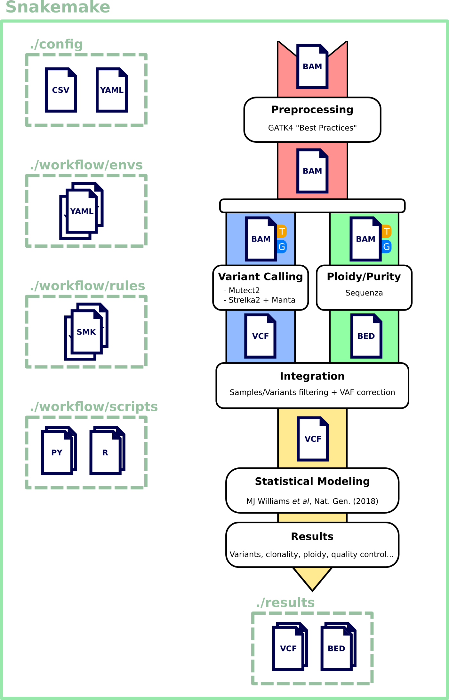

# Yet Another Pipeline for Normal/Tumor Variant Calling from Whole-Exome Sequencing data v0.2

A Snakemake pipeline for the bioinformatics analysis of WES data with normal/tumor pair.

Rely on two variant callers:

- Mutect2 (GATK4)

- Strelka2 + Manta

    

